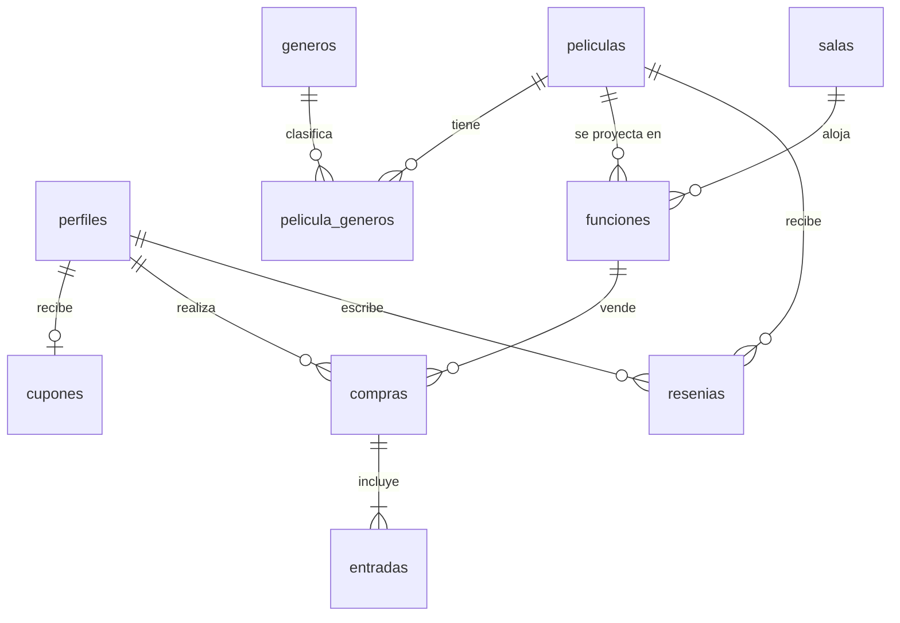

# Cine Avenida · TP 1 Programación IV

Aplicación web para un cine: cartelera, compra de entradas con PDF y código QR, reseñas y panel de administración.
Hecha con **Angular 21** y **Supabase**, instalable como **PWA**.

| | |
|---|---|
| **Deploy** | _pendiente_ |
| **Repositorio** | _pendiente_ |
| **Estado** | Consigna + emails del 01/01 y 16/01 implementados |

## Índice

1. [Cómo levantar el proyecto](#1-cómo-levantar-el-proyecto)
2. [Arquitectura](#2-arquitectura)
3. [Decisiones técnicas](#3-decisiones-técnicas)
4. [Documento funcional (requerimientos por email)](#4-documento-funcional-requerimientos-por-email)
5. [Criterios adoptados](#5-criterios-adoptados)
6. [Historial de actualizaciones](#6-historial-de-actualizaciones)

---

## 1. Cómo levantar el proyecto

### Requisitos

- Node.js 20.19 o superior (probado con Node 24)
- Una cuenta gratuita en [Supabase](https://supabase.com)

### Pasos

1. Instalar dependencias:

   ```bash
   npm install
   ```

2. Crear un proyecto en Supabase.
3. En **SQL Editor**, ejecutar completo `supabase/schema.sql` y después `supabase/seed.sql` (datos de ejemplo: 4 salas, 6 películas y funciones para los próximos 7 días).
4. En **Project Settings > API**, copiar la *Project URL* y la *anon public key* en `src/environments/environment.ts`.
5. Para probar sin confirmar emails: **Authentication > Sign In / Providers > Email** y desactivar *Confirm email*.
6. Levantar la app:

   ```bash
   npm start
   ```

   Abrir <http://localhost:4200>.

7. Crear el administrador: registrarse desde la app y ejecutar en el SQL Editor

   ```sql
   update public.perfiles set rol = 'admin' where email = 'tu-email@ejemplo.com';
   ```

   Cerrar sesión y volver a ingresar: aparece el menú **Administración**.

### Comandos

| Comando | Qué hace |
|---|---|
| `npm start` | Servidor de desarrollo en el puerto 4200 |
| `npm run build` | Build de producción en `dist/tp1-cine/browser` (incluye el service worker) |
| `npm run test:db` | Ejecuta `schema.sql` y `seed.sql` en un PostgreSQL en memoria y prueba las reglas de negocio |

### Probar la PWA

El service worker solo se activa en el build de producción:

```bash
npm run build
npx serve -s dist/tp1-cine/browser
```

### Deploy (Vercel)

1. Importar el repositorio en Vercel. `vercel.json` ya define el comando de build, la carpeta de salida y la redirección de rutas a `index.html`.
2. En Supabase, **Authentication > URL Configuration**: poner la URL del deploy como *Site URL* (la usan los emails de confirmación).

---

## 2. Arquitectura

### Stack

| Capa | Tecnología |
|---|---|
| Frontend | Angular 21: componentes standalone, signals, detección de cambios sin zone.js, formularios reactivos |
| Backend | Supabase: PostgreSQL, Auth, Storage, Row Level Security y funciones RPC |
| PWA | `@angular/service-worker` + `manifest.webmanifest` |
| PDF y QR | `jspdf` + `qrcode` |
| Hosting | Vercel |

### Estructura de carpetas

```text
supabase/
  schema.sql            tablas, restricciones, triggers, RPC y políticas RLS
  seed.sql              datos de ejemplo
  pruebas.mjs           pruebas de la base (npm run test:db)
src/
  environments/         URL y anon key de Supabase
  app/
    core/               lógica que no depende de la vista
      auth/             AuthService (sesión y perfil con signals) y guards
      models/           interfaces de los datos
      services/         acceso a Supabase por entidad + generación del PDF
      utils/            butacas, fechas, errores, QR
      constantes.ts
      supabase.service.ts
      titulo.strategy.ts
    shared/             piezas reutilizables
      components/       header, mapa de butacas, estrellas, tarjeta de película, errores de formulario
      pipes/            duracion, idioma
      validators.ts     validadores propios
    pages/              una carpeta por pantalla (todas con lazy loading)
      inicio/  pelicula-detalle/  comprar-entradas/  ver-compra/
      login/  registro/  mi-perfil/
      admin/            layout con pestañas + películas, funciones, salas y géneros
```

### Pantallas

| Ruta | Pantalla | Acceso |
|---|---|---|
| `/` | Cartelera: las 3 más vendidas + listado con buscador y filtro por género | Todos |
| `/peliculas/:id` | Detalle, puntaje promedio, reseñas y funciones | Todos |
| `/funciones/:id/comprar` | Mapa de butacas, resumen con cupón y pago | Todos (anónimo o registrado) |
| `/compras/:codigo` | Entrada con QR y descarga del PDF | Quien tenga el código |
| `/login`, `/registro` | Ingreso y registro | Solo sin sesión |
| `/perfil` | Datos, cupón y compras | Registrados |
| `/admin/...` | Películas, funciones, salas y géneros | Administradores |

### Modelo de datos



- `funciones` guarda `fin` y `bloqueada_hasta` (fin + 30 min), calculados por un trigger a partir de la duración de la película.
- `entradas` tiene una fila por butaca con `unique (funcion_id, fila, numero)`.
- `puntajes_peliculas` es una vista con el promedio de estrellas por película.

### Flujo de compra

1. El cliente elige una función en el detalle de la película.
2. La pantalla de compra carga la función y las butacas ocupadas y muestra el mapa (20 filas, bloques de 4, 20 y 4).
3. Si está logueado se consulta su cupón y se muestra el descuento. Si es anónimo se le piden nombre y email.
4. Al pagar (simulado) se llama a la función `comprar_entradas()` de la base, que en una sola transacción:
   valida la función y las butacas, calcula el total con el precio de la base, aplica y marca el cupón,
   crea la compra y las entradas, y devuelve el código de la compra.
5. Se redirige a `/compras/:codigo`, que muestra el QR (con ese código) y permite descargar el PDF.

---

## 3. Decisiones técnicas

**Angular**

- **Componentes standalone y signals** para el estado de cada pantalla (`signal`, `computed`, `input`, `model`). Es lo recomendado en Angular 21 y permite trabajar sin zone.js.
- **Lazy loading** en todas las rutas; el panel de administración es un grupo de rutas hijas con su propio layout.
- **Guards funcionales**: `authGuard`, `adminGuard` e `invitadoGuard`. Esperan a que se resuelva la sesión guardada antes de decidir.
- **`withComponentInputBinding`**: los parámetros de la ruta (`:id`, `:codigo`, `?volver=`) llegan como `input()`.
- **Formularios reactivos** con validadores propios: contraseñas iguales, fecha de nacimiento válida, vencimiento de tarjeta y horario futuro. Un componente `app-error-campo` muestra los mensajes.
- **Servicios por entidad** (`PeliculasService`, `FuncionesService`, etc.). Los componentes no usan Supabase directamente.
- **Pipes propios** (`duracion`, `idioma`), `TitleStrategy` propia y locale `es-AR` para fechas y precios.
- **RxJS** donde aporta: búsqueda con `debounceTime` convertida a signal con `toSignal`.
- **jsPDF se carga recién al descargar** el PDF (`import()` dinámico) para no sumar ~400 kB a la carga inicial.

**Supabase y reglas de negocio**

- **Las reglas importantes viven en la base**, no solo en el frontend:
  - 30 minutos entre funciones de una misma sala: restricción `EXCLUDE USING gist` sobre el rango `[inicio, fin + 30 min)`. Es imposible guardar funciones superpuestas, incluso con dos administradores a la vez.
  - Si cambia la duración de una película, un trigger recalcula sus funciones y la restricción rechaza el cambio si genera superposición.
  - Una butaca no se vende dos veces: `unique (funcion_id, fila, numero)`.
- **La compra es una función RPC `security definer`**: el precio y el descuento nunca vienen del cliente, y el cupón se bloquea con `for update` para no usarlo dos veces.
- **El frontend valida antes** para dar mejores mensajes: al crear una función lista las funciones que chocan y a qué hora queda libre la sala.
- **Registro**: los datos del perfil viajan como metadata del `signUp` y un trigger sobre `auth.users` crea el perfil y el cupón.
- **Row Level Security** en todas las tablas: el catálogo es de lectura pública y solo el admin lo modifica; cada usuario ve sus cupones, compras y perfil. `entradas` es de lectura pública porque solo tiene función, fila y número, y hace falta para el mapa de butacas.
- **Compras anónimas**: la entrada se consulta con el código (UUID, no adivinable) mediante `obtener_compra()`.
- **Storage**: bucket público `posters` para las imágenes; solo el admin puede subir.
- **Pruebas de la base** con PGlite (PostgreSQL compilado a WebAssembly) para verificar el esquema y las reglas sin depender de un proyecto de Supabase.

**PWA**

- Service worker con el *app shell* precargado y un `dataGroup` con estrategia *freshness* para la cartelera: con conexión trae datos nuevos y sin conexión muestra los últimos guardados.
- Aviso de nueva versión disponible con `SwUpdate`.
- Manifest e íconos propios.

**Interfaz**

- CSS propio sin librerías de componentes, con variables CSS y un solo color principal. Diseño simple y legible.
- Fechas sin calendario desplegable: la fecha de nacimiento se elige con tres listas (día, mes, año) y el día de una función con botones de los próximos 14 días.
- El pago es **simulado**: se validan los datos de la tarjeta pero no se procesa ningún cobro.

---

## 4. Documento funcional (requerimientos por email)

Referencias: `[x]` implementado · `[ ]` pendiente.

### Consigna

- [x] Crear un documento que resuma todos los requerimientos (esta sección)
- [ ] Crear la aplicación completa usando los temas vistos en clase (en curso)
- [ ] Defender oralmente las decisiones el día de la entrega
- [ ] Aplicación desplegada con URL funcional
- [ ] Código en GitHub
- [x] README con arquitectura y decisiones técnicas

### A considerar

- [x] Estilo visual propio (simple y prolijo)
- [ ] Aplicar los cambios que indiquen los profesores
- [ ] La aprobación y/o promoción depende de la defensa oral
- [x] Uso correcto de Angular, buenas prácticas y técnicas vistas en clase
- [x] Integración con Supabase (Auth, base de datos, RLS, RPC y Storage)
- [x] Integración de PWA
- [x] Lógica de negocio

### Email 1 · 01/01/2020 · Sistema base

- [x] Página propia para sacar entradas
- [x] Un edificio con varias salas (alta, baja y activación de salas)
- [x] Compra de entradas que genera un PDF con los datos de la entrada y un QR para ingresar
- [x] Salas de 20 filas identificadas con letras y 3 bloques de 4, 20 y 4 butacas
- [x] Elegir qué películas aparecen al entrar a la página (marca "en cartelera")
- [x] Definir los horarios de cada película (funciones)
- [x] Formato de la función: 2D, 3D, 4D o 5D
- [x] Idioma de la función: castellano o subtitulada
- [x] Película con duración, imagen, nombre y sinopsis
- [x] No puede empezar una función antes de que pasen 30 minutos del final de la anterior en esa sala
- [x] Registro con mail, nombre, apellido, fecha de nacimiento, tipo de sangre, color de ojos y días de vacaciones por año
- [x] Cupón de 20% de descuento en la primera compra por registrarse
- [x] Compra sin registrarse

### Email 2 · 16/01/2020 · Reseñas, más vendidas y buscador

- [x] Reseñas: calificación con estrellas y comentario corto
- [x] Las reseñas se ven antes de sacar las entradas (detalle de la película)
- [x] Puntaje promedio de cada película
- [x] La página principal muestra primero las 3 películas más vendidas
- [x] Buscador en el listado de películas

### Email 3 · 16/01/2020 · Filtro por género

- [x] El buscador filtra por género
- [x] Cada película puede tener varios géneros

### Email 4 · 30/01/2020 · Cupones y candy bar

- [ ] Porcentaje del cupón de primera compra configurable por el admin
- [ ] Cupones que solo aplican a usuarios de más de 50 años
- [ ] Productos del candy bar (pochoclos, bebidas, etc.) con categorías
- [ ] Comprar productos junto con la entrada
- [ ] Retirar los productos con el mismo QR
- Mapa del cine con la sala de la entrada: **sin aprobación del cliente, no se implementa**

### Email 5 · 06/02/2020 · Roles y validación de QR

- [ ] Administrador que controla salas, funciones, distribución de butacas, productos, etc. (ya existe el rol admin para películas, funciones, salas y géneros)
- [ ] Usuarios empleados que escanean los QR (cine y candy bar)
- [ ] Ingreso manual del código si falla el lector
- [ ] El QR deja de funcionar una vez validada la entrada o entregada la comida
- [ ] Asignación automática de sala
- [x] Nunca dos funciones en la misma sala al mismo tiempo (garantizado por la base desde el email 1)
- [ ] Programar una película varios días a la misma hora (ej.: lunes, martes y viernes a las 18 h)

### Email 6 · 12/02/2020 · Edad, accesibilidad y tiempo real

- [ ] Restricción de edad por película: ATP, +13 o +18
- [ ] Los menores de la edad indicada no pueden comprar
- [ ] Las entradas de esas películas aclaran que debe ir un adulto
- [ ] Filas J y K reemplazadas por butacas para personas con discapacidad (2, 10 y 2 por bloque)
- [ ] Butacas en tiempo real: ver las que ocupa otra compra en ese momento
- [ ] Butacas accesibles resaltadas visualmente

### Email 7 · 28/02/2020 · Usabilidad y reporte

- [ ] Interfaces fáciles de navegar para clientes y empleados
- [x] Ingreso de fechas y horas sin calendarios lentos (aplicado en registro y alta de funciones)
- [ ] Evitar el scroll excesivo
- [ ] Reporte de facturación por día y cantidad de entradas vendidas

### Email 8 · 03/03/2020 · Fidelización y combos

- [ ] 1 punto por cada peso gastado (usuarios registrados)
- [ ] Canje de puntos por entradas o productos del candy bar
- [ ] El admin configura cuántos puntos cuesta cada recompensa
- [ ] El perfil muestra los puntos acumulados y el historial de canjes
- [ ] Los puntos no se pueden transferir
- [ ] Combos (entrada + pochoclos + bebida) a precio fijo configurable
- [ ] Combos destacados en la página de compra

### Email 9 · 08/03/2020 · Próximamente, preventa y Mis películas

- [ ] Sección "Próximamente" con los estrenos de las próximas semanas
- [ ] Alerta para recibir una notificación cuando se habilita la venta
- [ ] Preventa desde 7 días antes del estreno con precio especial, configurable por película
- [ ] "Mis películas": historial visual con póster, fecha y calificación propia

### Email 10 · 10/03/2020 · Cancelaciones, VIP, reportes y log

- [ ] Cancelar una compra hasta 2 horas antes de la función
- [ ] Devolución como crédito en la cuenta, visible en el perfil y combinable con otros medios de pago
- [ ] Butacas VIP en las filas R, S y T con precio más alto
- [ ] Butacas VIP marcadas en el mapa y avisadas antes de pagar
- [ ] Exportar el reporte de facturación a PDF y Excel
- [ ] Gráfico de películas más vistas por semana y por mes
- [ ] Producto del candy bar más vendido
- [ ] Log de actividad: quién creó cada función, quién modificó un precio, quién validó un QR, con fecha y hora

---

## 5. Criterios adoptados

Puntos que los emails no definen y cómo se resolvieron:

| Tema | Criterio |
|---|---|
| Quién puede dejar reseñas | Solo usuarios registrados, una por película (se puede editar o borrar). No se exige haber visto la película. |
| Filtro con varios géneros | Se muestran las películas que tienen **todos** los géneros elegidos. |
| Las 3 más vendidas | Por cantidad de entradas vendidas de películas en cartelera. Si ninguna tiene ventas la sección no se muestra. |
| Cupón de primera compra | Se aplica solo en la primera compra del usuario registrado. No aplica a compras anónimas. |
| Precio de la entrada | Se define en cada función (los emails no indican cómo se calcula). |
| Butacas por compra | Máximo 10. |
| Datos en compras anónimas | Nombre y email. La entrada se consulta con el código de la compra. |
| Pago | Simulado. |

Dudas ya detectadas para los próximos emails:

- Email 6: las filas J y K se reemplazan por **una** fila accesible o las dos quedan como accesibles.
- Email 6 y email 4: cómo validar la edad (restricción por película y cupón para mayores de 50) en compras anónimas, que no tienen fecha de nacimiento.
- Email 10: cómo dar crédito por cancelación en una compra anónima.

---

## 6. Historial de actualizaciones

| Fecha | Versión | Cambios |
|---|---|---|
| 14/09/2026 | 0.1.1 | Proyecto de Supabase creado (región São Paulo) y configurado en `environment.ts` con la publishable key. Esquema y datos de ejemplo cargados; confirmación de email desactivada para pruebas. |
| 14/09/2026 | 0.1.0 | Proyecto inicial en Angular 21 con PWA. Base de datos en Supabase (esquema, RLS, RPC, datos de ejemplo y pruebas). Implementados la consigna y los emails del 01/01 y 16/01: cartelera con las 3 más vendidas, buscador y filtro por género, detalle con reseñas y puntaje, compra con mapa de butacas, cupón de primera compra, compra anónima, entrada con QR y PDF, registro, perfil y panel de administración de películas, funciones, salas y géneros. README con documento funcional. |
