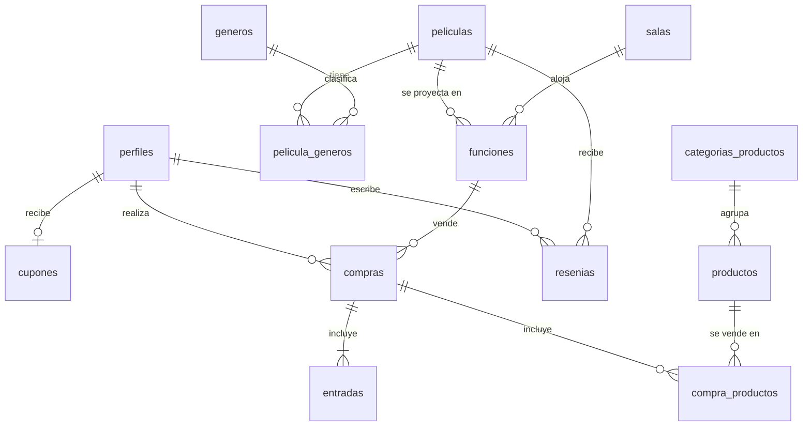

# Cine Avenida · Documento técnico

Cómo levantar el proyecto, cómo está construido y por qué se resolvió así.
Qué hace la aplicación y para quién está en [FUNCIONAL.md](FUNCIONAL.md).

## Índice

1. [Cómo levantar el proyecto](#1-cómo-levantar-el-proyecto)
2. [Arquitectura](#2-arquitectura)
3. [Decisiones técnicas](#3-decisiones-técnicas)
4. [Historial de actualizaciones](#4-historial-de-actualizaciones)

---

## 1. Cómo levantar el proyecto

### Requisitos

- Node.js 20.19 o superior (probado con Node 24)
- Una cuenta gratuita en [Supabase](https://supabase.com)

### Pasos

1. Instalar dependencias:

   ```bash
   npm install
   ```

2. Crear un proyecto en Supabase.
3. En **SQL Editor**, ejecutar completo `supabase/schema.sql` y después `supabase/seed.sql` (datos de ejemplo: 4 salas, 6 películas, funciones para los próximos 7 días y 10 productos de candy bar).
   Si la base se creó con una versión anterior del esquema, ejecutar también los archivos de `supabase/migraciones/` en orden.
   **Importante:** una base creada antes del candy bar necesita `supabase/migraciones/003_candybar_roles_qr.sql`; sin eso, la compra y el panel fallan porque faltan tablas y funciones.
4. Copiar en `src/environments/environment.ts` la *Project URL* (**Project Settings > Data API**) y la *publishable key* (**Project Settings > API Keys**).
5. Para probar sin confirmar emails: **Authentication > Sign In / Providers > Email** y desactivar *Confirm email*.
6. Levantar la app:

   ```bash
   npm start
   ```

   Abrir <http://localhost:4200>.

7. Crear el administrador: registrarse desde la app y ejecutar en el SQL Editor

   ```sql
   update public.perfiles set rol = 'admin' where email = 'tu-email@ejemplo.com';
   ```

   Cerrar sesión y volver a ingresar: aparece el menú **Administración**.

8. Para dar de alta al personal que valida los QR: **Administración > Usuarios** y cambiar el rol a *Empleado*.
   Ese usuario ve el menú **Validar QR**.

### Comandos

| Comando | Qué hace |
|---|---|
| `npm start` | Servidor de desarrollo en el puerto 4200 |
| `npm run build` | Build de producción en `dist/tp1-cine/browser` (incluye el service worker) |
| `npm run test:db` | Ejecuta el esquema, los datos de ejemplo y las migraciones en un PostgreSQL en memoria y prueba las reglas de negocio |

### Probar la PWA

El service worker solo se activa en el build de producción:

```bash
npm run build
npx serve -s dist/tp1-cine/browser
```

### Deploy (Vercel)

1. Importar el repositorio en Vercel. `vercel.json` ya define el comando de build, la carpeta de salida y la redirección de rutas a `index.html`.
2. En Supabase, **Authentication > URL Configuration**: poner la URL del deploy como *Site URL* (la usan los emails de confirmación).

---

## 2. Arquitectura

### Stack

| Capa | Tecnología |
|---|---|
| Frontend | Angular 21: componentes standalone, signals, detección de cambios sin zone.js, formularios reactivos, HttpClient |
| Backend | Supabase: PostgreSQL, Auth, Storage, Row Level Security y funciones RPC |
| PWA | `@angular/service-worker` + `manifest.webmanifest` |
| PDF y QR | `jspdf` + `qrcode` |
| Tipografía | Oswald incluida en el proyecto (`@fontsource/oswald`), funciona sin conexión |
| Hosting | Vercel |

### Estructura de carpetas

```text
supabase/
  schema.sql            tablas, restricciones, triggers, RPC y políticas RLS
  seed.sql              datos de ejemplo
  migraciones/          cambios para bases creadas con una versión anterior
  pruebas.mjs           pruebas de la base (npm run test:db)
src/
  environments/         URL y publishable key de Supabase
  app/
    core/               lógica que no depende de la vista
      auth/             AuthService (sesión y perfil con signals) y guards
      http/             adaptador HttpClient -> fetch, interceptores y estado de red
      models/           interfaces de los datos
      services/         acceso a Supabase por entidad + generación del PDF
      utils/            butacas, fechas, errores, QR
      constantes.ts
      supabase.service.ts
      titulo.strategy.ts
    shared/             piezas reutilizables
      components/       header, mapa de butacas, estrellas, tarjeta de película, errores de formulario
      directives/       appMascara, appImagenRespaldo, *appSiRol, appAutoFoco
      pipes/            duracion, idioma
      validators.ts     validadores propios
    pages/              una carpeta por pantalla (todas con lazy loading)
      inicio/  pelicula-detalle/  comprar-entradas/  ver-compra/
      login/  registro/  mi-perfil/  no-encontrada/
      validar/          lectura del QR para el personal del cine
      admin/            layout con pestañas + películas, funciones, salas, géneros,
                        candy bar, descuentos y usuarios
```

### Rutas

| Ruta | Pantalla | Acceso |
|---|---|---|
| `/` | Cartelera: las 3 más vendidas + listado con buscador y filtro por género | Todos |
| `/peliculas/:id` | Detalle, puntaje promedio, reseñas y funciones | Todos |
| `/funciones/:id/comprar` | Mapa de butacas, resumen con cupón y pago | Todos (anónimo o registrado) |
| `/compras/:codigo` | Entrada con QR y descarga del PDF | Quien tenga el código |
| `/login`, `/registro` | Ingreso y registro (`/login?volver=/ruta` vuelve a esa ruta después de ingresar) | Solo sin sesión |
| `/perfil` | Datos, descuentos y compras | Registrados |
| `/validar` | Validación de QR del ingreso y del candy bar | Empleados y administradores |
| `/admin/...` | Películas, funciones, salas, géneros, candy bar, descuentos y usuarios | Administradores |
| Cualquier otra | Página 404 | Todos |

### Modelo de datos



- `funciones` guarda `fin` y `bloqueada_hasta` (fin + 30 min), calculados por un trigger a partir de la duración de la película.
- `entradas` tiene una fila por butaca con `unique (funcion_id, fila, numero)`.
- `compra_productos` congela el nombre y el precio del producto: si después cambian, la compra no se altera.
- `compras` guarda cuándo y quién validó el ingreso (`validada_en`, `validada_por`) y la entrega del candy bar (`entregado_en`, `entregado_por`).
- `cupones_regla` tiene una fila por tipo de descuento (`primera_compra` y `mayores`) con el porcentaje, la edad mínima y si está activo.
- `puntajes_peliculas` es una vista con el promedio de estrellas por película.

### Flujo de compra

1. El cliente elige una función en el detalle de la película.
2. La pantalla de compra carga la función, las butacas ocupadas y el catálogo del candy bar, y muestra el mapa (20 filas, bloques de 4, 20 y 4).
3. Si está logueado se consultan sus descuentos con `mis_beneficios()`. Si es anónimo se le piden nombre y email.
4. Al pagar (simulado) se llama a la función `comprar_entradas()` de la base, que en una sola transacción:
   valida la función, las butacas y los productos, calcula el total con los precios de la base, aplica el mejor
   descuento (y marca el cupón si fue el de primera compra), crea la compra, las entradas y las líneas de
   productos, y devuelve el código de la compra.
5. Se redirige a `/compras/:codigo`, que muestra el QR (con ese código) y permite descargar el PDF.
6. En el cine, `validar_entrada()` y `entregar_productos()` marcan el código como usado. Las dos comprueban
   el rol con `es_empleado()` y rechazan un código ya usado.

### Cómo viajan las peticiones

```text
Cartelera (datos públicos):
  Inicio -> CarteleraService -> HttpClient.get -> API REST de Supabase

Lo que necesita la sesión del usuario (compras, reseñas, perfil, administración):
  Componente -> Servicio (ComprasService, ...) -> supabase-js -> fetch propio -> HttpClient -> Supabase

Todas las peticiones de HttpClient pasan por los interceptores:
  cargaInterceptor (barra de carga) y conexionInterceptor (aviso sin conexión)
```

---

## 3. Decisiones técnicas

**Angular**

- **Componentes standalone y signals** para el estado de cada pantalla (`signal`, `computed`, `input`, `model`). Es lo recomendado en Angular 21 y permite trabajar sin zone.js.
- **Ruteo**: todas las rutas con lazy loading; el panel de administración es un grupo de rutas hijas con su propio layout. La navegación usa `routerLink` en los enlaces y `Router` (`navigate`, `navigateByUrl`) después de acciones como ingresar, registrarse, comprar o salir.
- **Parámetros de ruta con `ActivatedRoute`**: `:id` y `:codigo` indican qué película, función o compra mostrar, y el query param `?volver=` indica a dónde volver después de ingresar (solo se aceptan rutas internas).
- **Ruta comodín `**`**: cualquier dirección que no existe muestra una página 404 con un enlace a la cartelera.
- **Guards funcionales** (esperan a que se resuelva la sesión guardada antes de decidir):
  - `canActivate`: `authGuard` en el perfil (sin sesión manda al login con `?volver=`) e `invitadoGuard` en login y registro.
  - `canMatch`: `adminGuard` en `/admin` y `empleadoGuard` en `/validar`. Si el usuario no tiene el rol la ruta no coincide, así el código de esa pantalla (lazy) ni siquiera se descarga.
  - `canActivateChild`: `rolAdminVigenteGuard` en las pantallas del panel. Vuelve a leer el rol desde la base al entrar a cada una, por si se lo quitaron mientras navegaba. `rolEmpleadoVigenteGuard` hace lo mismo en `/validar`.
  - `canDeactivate`: `cambiosSinGuardarGuard` en el formulario de película. Si hay cambios sin guardar pide confirmación antes de salir.
- **Formularios**, con el enfoque que mejor encaja en cada caso y siempre con validaciones:
  - *Reactive Forms* en los formularios grandes (registro, compra, reseñas, películas y funciones), con validadores propios: contraseñas iguales, fecha de nacimiento válida, vencimiento de tarjeta y horario futuro. El componente `app-error-campo` muestra los mensajes.
  - *Signal Forms* en el login: el modelo es un `signal`, `form()` le agrega las validaciones (`required`, `email`), los campos se vinculan con `[formField]` y los mensajes salen de `errors()`.
  - *Template-driven* en los formularios simples (nueva sala, nuevo género, nueva categoría del candy bar y el código de la entrada en la pantalla de validación), con `ngModel` y la validación `required` en el template.
- **Comunicación entre componentes** con `input()` y `output()`: por ejemplo, la pantalla de compra le pasa al mapa de butacas las ocupadas y el máximo, y el mapa le avisa con `seleccionadasChange` qué butacas se eligieron y con `limiteAlcanzado` si se intentó superar el máximo.
- **Servicios por entidad** (`PeliculasService`, `FuncionesService`, etc.). Los componentes no usan Supabase directamente.
- **Consumo de la API con `HttpClient.get`**: la cartelera la arma `CarteleraService` con tres peticiones GET a la API REST de Supabase (películas, puntajes y ventas), tipadas con interfaces (`Pelicula`, `Puntaje`, `VentasPelicula`) y combinadas con `forkJoin`. La pantalla de inicio se suscribe al observable y muestra la carga, los datos o el error. Lo que necesita la sesión del usuario usa supabase-js, que maneja el token.
- **Componentes standalone**, sin `NgModule` propios: cada componente declara lo que usa (por ejemplo `ReactiveFormsModule` o `RouterLink`).
- **HttpClient e interceptores**: supabase-js permite recibir su propio `fetch`. Se le pasa uno hecho con `HttpClient` (`core/http/fetch-con-http-client.ts`), así todas las llamadas a la base, a la autenticación y a Storage pasan por los interceptores:
  - `cargaInterceptor`: cuenta las peticiones en curso en un `BehaviorSubject` de `EstadoRedService`. Con operadores de RxJS la barra de carga aparece solo si la carga demora más de 200 ms y se oculta apenas termina.
  - `conexionInterceptor`: detecta la falta de conexión y muestra un aviso (junto con los eventos `online`/`offline` del navegador).
- **Directivas propias**:
  - `appMascara` (atributo): da formato mientras se escribe al número de tarjeta, al vencimiento `MM/AA` y a los campos solo numéricos.
  - `appImagenRespaldo` (atributo): si un póster no carga, muestra una imagen genérica.
  - `*appSiRol` (estructural): muestra contenido según el rol (`invitado`, `cliente`, `empleado`, `admin`); se usa en el menú.
  - `appAutoFoco` (atributo): pone el foco en el primer campo del login y del registro.
- **Pipes propios** (`duracion`, `idioma`), `TitleStrategy` propia y locale `es-AR` para fechas y precios.
- **Animaciones** con `animate.enter` / `animate.leave` de Angular 21 (el paquete `@angular/animations` quedó deprecado): aparición de tarjetas, ficha de película, entrada, reseñas y avisos. Son cortas y se desactivan si el sistema pide reducir movimiento. No se usa `withViewTransitions()` porque, mientras dura la transición entre pantallas, el navegador no entrega los clics a la página (se detectó en las pruebas).
- **RxJS** donde aporta: búsqueda con `debounceTime` convertida a signal con `toSignal`, interceptores y avisos del service worker.
- **jsPDF se carga recién al descargar** el PDF (`import()` dinámico) para no sumar ~400 kB a la carga inicial.
- **Lector de QR sin librerías**: la pantalla de validación usa `BarcodeDetector` y `getUserMedia`, que ya trae el navegador, y lee un fotograma cada 300 ms. Donde la API no existe se oculta la cámara y queda el ingreso manual del código, que el email pide igual como alternativa. La cámara se apaga al encontrar un código y en `ngOnDestroy`.

**Supabase y reglas de negocio**

- **Las reglas importantes viven en la base**, no solo en el frontend:
  - 30 minutos entre funciones de una misma sala: restricción `EXCLUDE USING gist` sobre el rango `[inicio, fin + 30 min)`. Es imposible guardar funciones superpuestas, incluso con dos administradores a la vez.
  - Si cambia la duración de una película, un trigger recalcula sus funciones y la restricción rechaza el cambio si genera superposición.
  - Una butaca no se vende dos veces: `unique (funcion_id, fila, numero)`.
  - Una función con entradas vendidas no puede cambiar de horario, sala, película, formato ni idioma (trigger `proteger_funcion_con_ventas`). Sí se puede cambiar el precio, que solo afecta a las ventas nuevas.
  - No se pueden programar funciones en el pasado ni en salas inactivas, tanto al crear como al editar.
- **La compra es una función RPC `security definer`**: el precio y el descuento nunca vienen del cliente, y el cupón se bloquea con `for update` para no usarlo dos veces. Los productos del candy bar viajan como `jsonb` (solo id y cantidad) y la base les pone el precio.
- **Descuentos configurables** (`cupones_regla`): el trigger de registro toma de ahí el porcentaje del cupón de bienvenida, y `comprar_entradas()` calcula el descuento por edad con `edad(fecha_nacimiento)`. Si aplican los dos se usa el mayor y se guarda el motivo en `compras.descuento_motivo`.
- **Validación del QR**: `validar_entrada()` y `entregar_productos()` toman la compra con `for update`, comprueban `es_empleado()`, rechazan un código ya usado y guardan quién y cuándo lo validó. Los empleados no tienen acceso directo a `compras`: leen por `compra_para_validar()`, que devuelve solo lo necesario para la puerta.
- **Asignación automática de sala**: `salas_libres()` cruza las salas activas con las funciones existentes usando el mismo rango `[inicio, fin + 30 min)` de la restricción. `programar_funciones()` crea un horario por día con un bloque `begin ... exception` por cada uno, así un choque no cancela el resto y la pantalla informa qué pasó con cada día.
- **Roles**: `cambiar_rol()` valida que quien llama sea admin, que el rol exista y que un administrador no se quite a sí mismo el permiso.
- **El frontend valida antes** para dar mejores mensajes: al crear o editar una función lista las funciones que chocan y a qué hora queda libre la sala; si la función tiene ventas, bloquea los campos que no se pueden cambiar.
- **Registro**: los datos del perfil viajan como metadata del `signUp` y un trigger sobre `auth.users` crea el perfil y el cupón.
- **Row Level Security** en todas las tablas: el catálogo es de lectura pública y solo el admin lo modifica; cada usuario ve sus cupones, compras y perfil. `entradas` es de lectura pública porque solo tiene función, fila y número, y hace falta para el mapa de butacas.
- **Compras anónimas**: la entrada se consulta con el código (UUID, no adivinable) mediante `obtener_compra()`.
- **Storage**: bucket público `posters` para las imágenes; solo el admin puede subir.
- **Migraciones**: `schema.sql` siempre tiene el esquema completo para una base nueva; los cambios posteriores también se publican en `supabase/migraciones/` para aplicarlos sobre una base existente.
- **Pruebas de la base** con PGlite (PostgreSQL compilado a WebAssembly): verifican el esquema, las migraciones y las reglas sin depender de un proyecto de Supabase.

**PWA**

- Service worker con el *app shell* precargado y un `dataGroup` con estrategia *freshness* para la cartelera y el catálogo del candy bar: con conexión trae datos nuevos y sin conexión muestra los últimos guardados. Las llamadas que cambian datos (compra, validación de QR) no se cachean.
- Aviso de nueva versión disponible con `SwUpdate` y aviso de "sin conexión".
- Manifest, íconos y tipografía propios incluidos en la app.

**Interfaz**

- Identidad propia sin librerías de componentes: fondo cálido, títulos en Oswald (tipografía de marquesina de cine), un rojo como color principal y variables CSS para mantener todo coherente.
- Detalles de diseño: logo con forma de entrada, ficha de película con el póster desenfocado de fondo, distintivo de color para cada formato (2D, 3D, 4D, 5D), mapa de butacas con pantalla curva y la entrada con forma de ticket (talón con el QR y muescas).
- Fechas sin calendario desplegable: la fecha de nacimiento se elige con tres listas (día, mes, año) y el día de una función con botones de los próximos 14 días.
- El pago es **simulado**: se validan los datos de la tarjeta pero no se procesa ningún cobro.

---

## 4. Historial de actualizaciones

| Fecha | Versión | Cambios |
|---|---|---|
| 15/09/2026 | 0.3.0 | Emails del 30/01 y del 06/02. Candy bar: categorías y productos con su ABM, compra junto con la entrada y retiro con el mismo QR. Descuentos configurables: porcentaje del cupón de bienvenida y descuento por edad con su edad mínima. Rol de empleado y pantalla de validación de QR con cámara o código manual, que marca el ingreso y la entrega como usados. Panel de usuarios para asignar roles. Programación de la misma película en varios días y asignación automática de sala. Migración `003_candybar_roles_qr.sql` y 25 pruebas nuevas en `npm run test:db`. |
| 15/09/2026 | 0.2.6 | La documentación se divide en tres archivos: `README.md` con lo esencial, `FUNCIONAL.md` con los requerimientos y criterios, y `TECNICO.md` con la arquitectura y las decisiones. |
| 14/09/2026 | 0.2.5 | El panel de administración se protege con `canMatch` (su código no se descarga si el usuario no es admin) y `canActivateChild` (se vuelve a comprobar el rol en cada pantalla del panel). El formulario de película pide confirmación antes de salir con cambios sin guardar (`canDeactivate`). |
| 14/09/2026 | 0.2.4 | El login pasa a Signal Forms y los formularios de nueva sala y nuevo género a template-driven; el resto sigue con formularios reactivos. |
| 14/09/2026 | 0.2.3 | La cartelera se obtiene con peticiones GET de HttpClient a la API REST de Supabase (`CarteleraService`), tipadas con interfaces. Si la API no responde, la pantalla muestra un mensaje en lugar de quedar cargando. |
| 14/09/2026 | 0.2.2 | El mapa de butacas avisa cuando se intenta elegir más butacas de las permitidas por compra. La barra de carga aparece solo si la carga demora más de 200 ms. |
| 14/09/2026 | 0.2.1 | Página 404 para direcciones que no existen. Los parámetros de las rutas (`:id`, `:codigo` y `?volver=`) se leen con `ActivatedRoute`. |
| 14/09/2026 | 0.2.0 | Temas de clase: HttpClient con interceptores (barra de carga y aviso sin conexión) para todas las llamadas a Supabase, cuatro directivas propias (`appMascara`, `appImagenRespaldo`, `*appSiRol`, `appAutoFoco`) y animaciones con `animate.enter`/`animate.leave`. Nuevo estilo visual (Oswald, logo, ficha con póster de fondo, entrada tipo ticket, distintivos de formato, PDF con encabezado). Edición de funciones desde el panel de admin con la regla "con ventas solo cambia el precio" validada en la base (`supabase/migraciones/002_editar_funciones.sql`). Prueba completa en el navegador contra Supabase: registro, compras con y sin cupón, PDF, reseñas, compra anónima, buscador y filtros. |
| 14/09/2026 | 0.1.4 | Primer deploy en <https://avenida-cine.vercel.app>. Verificado: rutas internas, datos de Supabase, manifest, service worker e íconos de la PWA. |
| 14/09/2026 | 0.1.3 | Proyecto creado en Vercel (`avenida-cine`), conectado al repositorio para publicar automáticamente con cada cambio en `main`. |
| 14/09/2026 | 0.1.2 | Código publicado en GitHub: <https://github.com/KevinPlucci/Avenida-Cine>. |
| 14/09/2026 | 0.1.1 | Proyecto de Supabase creado (región São Paulo) y configurado en `environment.ts` con la publishable key. Esquema y datos de ejemplo cargados; confirmación de email desactivada para pruebas. |
| 14/09/2026 | 0.1.0 | Proyecto inicial en Angular 21 con PWA. Base de datos en Supabase (esquema, RLS, RPC, datos de ejemplo y pruebas). Implementados la consigna y los emails del 01/01 y 16/01: cartelera con las 3 más vendidas, buscador y filtro por género, detalle con reseñas y puntaje, compra con mapa de butacas, cupón de primera compra, compra anónima, entrada con QR y PDF, registro, perfil y panel de administración de películas, funciones, salas y géneros. Documento funcional en el README. |
