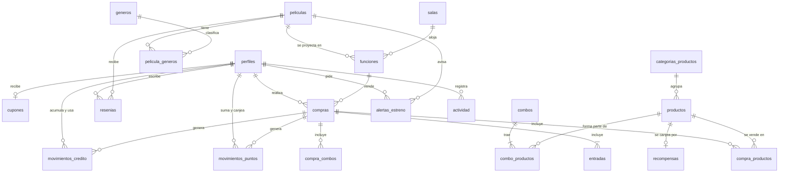

# Cine Avenida · Documento técnico

Cómo levantar el proyecto, cómo está construido y por qué se resolvió así.
Qué hace la aplicación y para quién está en [FUNCIONAL.md](FUNCIONAL.md).

## Índice

1. [Cómo levantar el proyecto](#1-cómo-levantar-el-proyecto)
2. [Arquitectura](#2-arquitectura)
3. [Decisiones técnicas](#3-decisiones-técnicas)
4. [Historial de actualizaciones](#4-historial-de-actualizaciones)

---

## 1. Cómo levantar el proyecto

### Requisitos

- Node.js 20.19 o superior (probado con Node 24)
- Una cuenta gratuita en [Supabase](https://supabase.com)

### Pasos

1. Instalar dependencias:

   ```bash
   npm install
   ```

2. Crear un proyecto en Supabase.
3. En **SQL Editor**, ejecutar completo `supabase/schema.sql` y después `supabase/seed.sql` (datos de ejemplo: 4 salas, 6 películas con su restricción de edad, 2 próximos estrenos (uno con preventa), funciones para los próximos 7 días, 10 productos de candy bar, 2 combos y los puntos de las recompensas).
   Si la base se creó con una versión anterior del esquema, ejecutar también los archivos de `supabase/migraciones/` en orden.
   **Importante:** una base creada antes del candy bar necesita `supabase/migraciones/003_candybar_roles_qr.sql`; sin eso, la compra y el panel fallan porque faltan tablas y funciones.
   Una base que ya tiene la 003 necesita también, en orden, las migraciones siguientes (`004_...`, `005_...`, etc.).
4. Copiar en `src/environments/environment.ts` la *Project URL* (**Project Settings > Data API**) y la *publishable key* (**Project Settings > API Keys**).
5. Para probar sin confirmar emails: **Authentication > Sign In / Providers > Email** y desactivar *Confirm email*.
6. Levantar la app:

   ```bash
   npm start
   ```

   Abrir <http://localhost:4200>.

7. Crear el administrador: registrarse desde la app y ejecutar en el SQL Editor

   ```sql
   update public.perfiles set rol = 'admin' where email = 'tu-email@ejemplo.com';
   ```

   Cerrar sesión y volver a ingresar: aparece el menú **Administración**.

8. Para dar de alta al personal que valida los QR: **Administración > Usuarios** y cambiar el rol a *Empleado*.
   Ese usuario ve el menú **Validar QR**.

### Comandos

| Comando | Qué hace |
|---|---|
| `npm start` | Servidor de desarrollo en el puerto 4200 |
| `npm run build` | Build de producción en `dist/tp1-cine/browser` (incluye el service worker) |

### Probar la PWA

El service worker solo se activa en el build de producción:

```bash
npm run build
npx serve -s dist/tp1-cine/browser
```

### Deploy (Vercel)

1. Importar el repositorio en Vercel. `vercel.json` ya define el comando de build, la carpeta de salida y la redirección de rutas a `index.html`.
2. En Supabase, **Authentication > URL Configuration**: poner la URL del deploy como *Site URL* (la usan los emails de confirmación).

### Supabase pausado

El plan gratuito de Supabase pausa el proyecto después de 7 días sin actividad: la dirección de la base deja de existir
y la app no carga datos. Para evitarlo, `.github/workflows/mantener-supabase.yml` llama cada 2 días a la función
`latido()`, que actualiza una fecha en la tabla `latidos` (también se puede correr a mano desde
**Actions > Mantener Supabase activo > Run workflow**). Al principio la tarea hacía solo una consulta de lectura y el
proyecto se pausó igual, por eso ahora escribe. No es una garantía: antes de una presentación conviene revisar en el
panel de Supabase que el proyecto esté activo.
Si igual se pausa: en el panel de Supabase abrir el proyecto y tocar **Restore project**; tarda unos minutos.

---

## 2. Arquitectura

### Stack

| Capa | Tecnología |
|---|---|
| Frontend | Angular 21: componentes standalone, signals, detección de cambios sin zone.js, formularios reactivos, HttpClient |
| Backend | Supabase: PostgreSQL, Auth, Storage, Row Level Security y funciones RPC |
| PWA | `@angular/service-worker` + `manifest.webmanifest` |
| PDF, Excel y QR | `jspdf` para la entrada y el reporte, `write-excel-file` para el reporte en Excel, `qrcode` para generar el QR y `jsqr` para leerlo con la cámara |
| Tipografía | Oswald incluida en el proyecto (`@fontsource/oswald`), funciona sin conexión |
| Hosting | Vercel |

### Estructura de carpetas

```text
supabase/
  schema.sql            tablas, restricciones, triggers, RPC y políticas RLS
  seed.sql              datos de ejemplo
  migraciones/          cambios para bases creadas con una versión anterior
src/
  environments/         URL y publishable key de Supabase
  app/
    core/               lógica que no depende de la vista
      auth/             AuthService (sesión y perfil con signals) y guards
      http/             adaptador HttpClient -> fetch, interceptores y estado de red
      models/           interfaces de los datos
      services/         acceso a Supabase por entidad + generación del PDF
      utils/            butacas, estreno y preventa, fechas, errores, QR
      constantes.ts
      supabase.service.ts
      titulo.strategy.ts
    shared/             piezas reutilizables
      components/       header, mapa de butacas, contador, estrellas, tarjeta de película, botón de alerta,
                        gráfico de barras, errores de formulario
      directives/       appMascara, appImagenRespaldo, *appSiRol, appAutoFoco
      pipes/            duracion, idioma, restriccion
      validators.ts     validadores propios
    pages/              una carpeta por pantalla (todas con lazy loading)
      inicio/  pelicula-detalle/  comprar-entradas/  ver-compra/
      login/  registro/  mi-perfil/  mis-peliculas/  no-encontrada/
      validar/          lectura del QR para el personal del cine
      admin/            layout con pestañas + películas, funciones, salas, géneros,
                        candy bar, combos, descuentos, puntos, usuarios, reportes y actividad
```

### Rutas

| Ruta | Pantalla | Acceso |
|---|---|---|
| `/` | Cartelera: las 3 más vendidas + listado con buscador y filtro por género + Próximamente | Todos |
| `/peliculas/:id` | Detalle, estreno y preventa, puntaje promedio, reseñas y funciones | Todos |
| `/funciones/:id/comprar` | Mapa de butacas en tiempo real, combos, candy bar, canje de puntos, resumen con descuento y pago | Todos (anónimo o registrado) |
| `/compras/:codigo` | Entrada con QR y descarga del PDF | Quien tenga el código |
| `/login`, `/registro` | Ingreso y registro (`/login?volver=/ruta` vuelve a esa ruta después de ingresar) | Solo sin sesión |
| `/perfil` | Datos, descuentos, puntos, historial de canjes y compras | Registrados |
| `/mis-peliculas` | Historial visual de las películas vistas, con fechas y calificación | Registrados |
| `/validar` | Validación de QR del ingreso y del candy bar | Empleados y administradores (otra cuenta ve la 404) |
| `/admin/...` | Películas, funciones, salas, géneros, candy bar, combos, descuentos, puntos, usuarios, reportes y actividad | Administradores (otra cuenta ve la 404) |
| Cualquier otra | Página 404 | Todos |

### Modelo de datos


```mermaid
erDiagram
  perfiles ||--o| cupones : "recibe"
  perfiles ||--o{ compras : "realiza"
  perfiles ||--o{ resenias : "escribe"
  peliculas ||--o{ pelicula_generos : "tiene"
  generos ||--o{ pelicula_generos : "clasifica"
  peliculas ||--o{ funciones : "se proyecta en"
  salas ||--o{ funciones : "aloja"
  funciones ||--o{ compras : "vende"
  compras ||--|{ entradas : "incluye"
  compras ||--o{ compra_productos : "incluye"
  categorias_productos ||--o{ productos : "agrupa"
  productos ||--o{ compra_productos : "se vende en"
  combos ||--|{ combo_productos : "trae"
  productos ||--o{ combo_productos : "forma parte de"
  compras ||--o{ compra_combos : "incluye"
  productos ||--o| recompensas : "se canjea por"
  perfiles ||--o{ movimientos_puntos : "suma y canjea"
  compras ||--o{ movimientos_puntos : "genera"
  peliculas ||--o{ resenias : "recibe"
  perfiles ||--o{ alertas_estreno : "pide"
  peliculas ||--o{ alertas_estreno : "avisa"
  perfiles ||--o{ movimientos_credito : "acumula y usa"
  compras ||--o{ movimientos_credito : "genera"
  perfiles ||--o{ actividad : "registra"
```

- `peliculas.restriccion_edad` guarda la edad mínima: 0 (ATP), 13 o 18.
- `peliculas.fecha_estreno` y `peliculas.precio_preventa`: sin fecha, la película ya está en cartelera; con fecha futura va en "Próximamente" y, con precio de preventa, la venta abre 7 días antes. `compras.preventa` indica que las entradas se cobraron a ese precio.
- `alertas_estreno` guarda la alerta de cada usuario por película y cuándo se le avisó (`avisada_en`).
- `configuracion` tiene una sola fila con el recargo de las butacas VIP. `entradas.precio` guarda el precio de cada butaca con el recargo y `compras.subtotal_vip` el recargo de la compra.
- `compras` guarda la cancelación: `cancelada_en`, `credito_generado` y `butacas_canceladas` (las entradas se borran para liberar las butacas). `credito_usado` es la parte del total pagada con crédito.
- `movimientos_credito` registra cada crédito (cancelación) y cada uso (compra), igual que los puntos: el saldo es la suma de los movimientos.
- `actividad` es el registro de actividad: fecha, usuario (con su nombre y email al momento de la acción), tipo (`funcion`, `precio` o `validacion`) y el detalle en texto.
- `latidos` tiene una sola fila con la fecha del último latido de la tarea programada (ver "Supabase pausado").
- `funciones` guarda `fin` y `bloqueada_hasta` (fin + 30 min), calculados por un trigger a partir de la duración de la película.
- `entradas` tiene una fila por butaca con `unique (funcion_id, fila, numero)`.
- `compra_productos` congela el nombre y el precio del producto: si después cambian, la compra no se altera.
- `compras` guarda cuándo y quién validó el ingreso (`validada_en`, `validada_por`) y la entrega del candy bar (`entregado_en`, `entregado_por`).
- `cupones_regla` tiene una fila por tipo de descuento (`primera_compra` y `mayores`) con el porcentaje, la edad (el descuento es para quienes la superan) y si está activo.
- `recompensas` tiene una fila para la entrada gratis y una por cada producto que se puede canjear, con su costo en puntos.
- `movimientos_puntos` registra cada suma (compra) y cada canje. El saldo es la suma de los movimientos, así el historial y el saldo nunca se contradicen.
- `compra_combos` congela el nombre, el precio y el contenido del combo vendido; `compra_productos.canjeados` guarda cuántas unidades se pagaron con puntos.
- `puntajes_peliculas` es una vista con el promedio de estrellas por película.

### Flujo de compra

1. El cliente elige una función en el detalle de la película.
2. La pantalla de compra carga la función, las butacas ocupadas, el catálogo del candy bar y los combos, muestra el mapa
   (filas A a T sin la K, la J accesible) y se suscribe a las ventas nuevas de esa función con Supabase Realtime.
3. Si está logueado se consultan sus descuentos con `mis_beneficios()` y sus puntos con `mis_puntos()`.
   Si es anónimo se le piden nombre y email, y la fecha de nacimiento si la película es +13 o +18.
4. Al pagar (simulado) se llama a la función `comprar_entradas()` de la base, que en una sola transacción:
   valida la función, que la venta de la película esté abierta, la edad, las butacas, los productos, los combos y el
   canje de puntos, calcula el total con los precios de la base (el de preventa hasta el estreno y el recargo de las
   butacas VIP), descuenta el crédito de la cuenta si el cliente lo pidió, aplica el mejor descuento (y marca el cupón si fue el de primera compra), crea la compra, las
   entradas y las líneas de productos y combos, descuenta los puntos canjeados, suma los ganados y devuelve el código.
5. Se redirige a `/compras/:codigo`, que muestra el QR (con ese código) y permite descargar el PDF.
6. En el cine, `validar_entrada()` y `entregar_productos()` marcan el código como usado. Las dos comprueban
   el rol con `es_empleado()`, rechazan un código ya usado o de una compra cancelada y solo lo aceptan desde una
   hora antes del inicio hasta que termina la función.
7. Hasta 2 horas antes, `cancelar_compra()` cancela la compra: borra sus entradas (el mapa de los demás se entera
   por Realtime), acredita el total, devuelve los puntos canjeados, descuenta los ganados y libera el cupón.

### Cómo viajan las peticiones

```text
Cartelera (datos públicos):
  Inicio -> CarteleraService -> HttpClient.get -> API REST de Supabase

Lo que necesita la sesión del usuario (compras, reseñas, perfil, administración):
  Componente -> Servicio (ComprasService, ...) -> supabase-js -> fetch propio -> HttpClient -> Supabase

Todas las peticiones de HttpClient pasan por los interceptores:
  cargaInterceptor (barra de carga) y conexionInterceptor (aviso sin conexión)
```

---

## 3. Decisiones técnicas

**Angular**

- **Componentes standalone y signals** para el estado de cada pantalla (`signal`, `computed`, `input`, `model`). Es lo recomendado en Angular 21 y permite trabajar sin zone.js.
- **Ruteo**: todas las rutas con lazy loading; el panel de administración es un grupo de rutas hijas con su propio layout. La navegación usa `routerLink` en los enlaces y `Router` (`navigate`, `navigateByUrl`) después de acciones como ingresar, registrarse, comprar o salir.
- **Parámetros de ruta con `ActivatedRoute`**: `:id` y `:codigo` indican qué película, función o compra mostrar, y el query param `?volver=` indica a dónde volver después de ingresar (solo se aceptan rutas internas).
- **Ruta comodín `**`**: cualquier dirección que no existe muestra una página 404 con un enlace a la cartelera.
- **Guards funcionales** (esperan a que se resuelva la sesión guardada antes de decidir):
  - `canActivate`: `authGuard` en el perfil (sin sesión manda al login con `?volver=`), `invitadoGuard` en login y registro, y `rolEmpleadoVigenteGuard` en `/validar`, que vuelve a leer el rol desde la base antes de abrir la pantalla.
  - `canMatch`: `adminGuard` en `/admin` y `empleadoGuard` en `/validar`. Se evalúan mientras Angular busca qué ruta coincide: sin sesión mandan al login; con sesión pero sin el rol devuelven `false`, la ruta no coincide y Angular sigue buscando en el arreglo de rutas hasta la 404 (`**`). Como la ruta no coincide, el código de esa pantalla (lazy) ni siquiera se descarga.
  - `canActivateChild`: `rolAdminVigenteGuard` en las pantallas del panel. Vuelve a leer el rol desde la base al entrar a cada una, por si se lo quitaron mientras navegaba.
  - `canDeactivate`: `cambiosSinGuardarGuard` en el formulario de película. Si hay cambios sin guardar pide confirmación antes de salir.
- **Formularios**, con el enfoque que mejor encaja en cada caso y siempre con validaciones:
  - *Reactive Forms* en los formularios grandes (registro, compra, reseñas, películas, funciones, productos, combos, descuentos y puntos), con validadores propios: contraseñas iguales, fecha de nacimiento válida, edad mínima, vencimiento de tarjeta y horario futuro. El componente `app-error-campo` muestra los mensajes.
  - *Signal Forms* en el login: el modelo es un `signal`, `form()` le agrega las validaciones (`required`, `email`), los campos se vinculan con `[formField]` y los mensajes salen de `errors()`.
  - *Template-driven* en los formularios simples (nueva sala, nuevo género, nueva categoría del candy bar y el código de la entrada en la pantalla de validación), con `ngModel` y la validación `required` en el template.
- **Comunicación entre componentes** con `input()` y `output()`: por ejemplo, la pantalla de compra le pasa al mapa de butacas las ocupadas y el máximo, y el mapa le avisa con `seleccionadasChange` qué butacas se eligieron y con `limiteAlcanzado` si se intentó superar el máximo.
- **Servicios por entidad** (`PeliculasService`, `FuncionesService`, etc.). Los componentes no usan Supabase directamente.
- **Consumo de la API con `HttpClient.get`**: la cartelera la arma `CarteleraService` con tres peticiones GET a la API REST de Supabase (películas, puntajes y ventas), tipadas con interfaces (`Pelicula`, `Puntaje`, `VentasPelicula`) y combinadas con `forkJoin`. La pantalla de inicio se suscribe al observable y muestra la carga, los datos o el error. Lo que necesita la sesión del usuario usa supabase-js, que maneja el token.
- **Componentes standalone**, sin `NgModule` propios: cada componente declara lo que usa (por ejemplo `ReactiveFormsModule` o `RouterLink`).
- **HttpClient e interceptores**: supabase-js permite recibir su propio `fetch`. Se le pasa uno hecho con `HttpClient` (`core/http/fetch-con-http-client.ts`), así todas las llamadas a la base, a la autenticación y a Storage pasan por los interceptores:
  - `cargaInterceptor`: cuenta las peticiones en curso en un `BehaviorSubject` de `EstadoRedService`. Con operadores de RxJS la barra de carga aparece solo si la carga demora más de 200 ms y se oculta apenas termina.
  - `conexionInterceptor`: detecta la falta de conexión y muestra un aviso (junto con los eventos `online`/`offline` del navegador).
- **Directivas propias**:
  - `appMascara` (atributo): da formato mientras se escribe al número de tarjeta, al vencimiento `MM/AA` y a los campos solo numéricos.
  - `appImagenRespaldo` (atributo): si un póster no carga, muestra una imagen genérica.
  - `*appSiRol` (estructural): muestra contenido según el rol (`invitado`, `cliente`, `empleado`, `admin`); se usa en el menú. Recibe la plantilla con `TemplateRef` y crea o borra la vista en su `ViewContainerRef`.
  - `appAutoFoco` (atributo): pone el foco en el primer campo del login y del registro.
  - Las de atributo acceden a su elemento con `ElementRef` y lo modifican con `Renderer2` (`setProperty` para el valor del input, `setAttribute` para el `src` de la imagen), sin tocar el DOM a mano.
- **Directivas de Angular en las plantillas**: `ngClass` en las butacas del mapa (libre, ocupada, elegida y accesible según el estado) y `ngStyle` para el póster de fondo de la ficha de la película. `ng-container` agrupa elementos sin agregar etiquetas al DOM (menú por rol y salidas de plantillas).
- **Plantillas reutilizables**: la cartelera define la grilla de películas una sola vez con `ng-template` y la dibuja con `ngTemplateOutlet` en "Las más vendidas" y en "En cartelera"; `ngTemplateOutletContext` le pasa la lista y si tiene que mostrar el ranking.
- **Proyección de contenido**: `app-contador` es la fila con los botones − / cantidad / + que se usa en los productos, los combos y el canje de puntos de la compra, y al armar un combo en el panel. Lo que va adentro de `<app-contador>` (nombre, precio, descripción) se proyecta con `ng-content`; el componente avisa cada cambio con un `output`.
- **Pipes**, siempre en la plantilla para no mezclar formato con lógica:
  - Nativos con parámetros y locale `es-AR` (moneda `ARS` por defecto): `date` con máscaras (`'dd/MM/yyyy'`, `"EEEE d 'de' MMMM"`), `currency`, `number` para los puntos, `percent` para los descuentos y `titlecase` para los nombres que escriben los usuarios.
  - Encadenados: los botones de día muestran `fecha | date: 'EEE d/M' | titlecase` ("Dom 27/9").
  - `async` para el aviso de nueva versión: la plantilla se suscribe al observable del service worker y se desuscribe sola.
  - Propios (`duracion`, `idioma`, `restriccion`): implementan `PipeTransform` y son puros, así que solo se recalculan cuando cambia el valor. Reciben valores simples, y las listas del estado se reemplazan por copias nuevas (`update` con `...`), nunca se mutan.
- **`TitleStrategy` propia** para el título de la pestaña.
- **Animaciones** con `animate.enter` / `animate.leave` de Angular 21 (el paquete `@angular/animations` quedó deprecado): aparición de tarjetas, ficha de película, entrada, reseñas y avisos. Son cortas y se desactivan si el sistema pide reducir movimiento. No se usa `withViewTransitions()` porque, mientras dura la transición entre pantallas, el navegador no entrega los clics a la página.
- **RxJS** donde aporta: búsqueda con `debounceTime` convertida a signal con `toSignal`, interceptores y avisos del service worker.
- **Alertas de estreno** (`AlertasService`): un `effect` carga las alertas del usuario cuando cambia la sesión. Depende de un `computed` con el id del usuario, así renovar el token no vuelve a consultar. Al ingresar y en cada `visibilitychange` (cuando se vuelve a la pestaña) llama a `avisar_alertas()`. Lo que devuelve se muestra en un aviso dentro de la página y como notificación del sistema con `registration.showNotification()` del service worker. El permiso se pide al activar la alerta, porque el navegador exige un clic del usuario. La notificación lleva `data.onActionClick` con la operación `navigateLastFocusedOrOpen`: el service worker de Angular abre la película al tocarla. En desarrollo, sin service worker, se usa `new Notification()`. No hay push con la app cerrada: haría falta un servidor que envíe las notificaciones con claves VAPID.
- **Estado de la venta en un solo lugar por capa**: `apertura_venta()` y `hoy_argentina()` en la base, y `core/utils/estreno.ts` (`estadoVenta()`) en el frontend, que decide si la película va en Próximamente, si la venta está abierta y si rige la preventa. Las fechas se comparan en hora de Argentina en las dos capas.
- **Crédito al pagar**: si el crédito cubre toda la compra, un `effect` deshabilita el grupo de la tarjeta del formulario reactivo (deja de validarse y no se muestra); si queda algo por pagar, lo vuelve a habilitar.
- **Exportar el reporte**: `ExportarReporteService` arma el PDF con jsPDF (tabla con encabezado repetido en cada página y totales) y un `.xlsx` real con `write-excel-file`, con los días como fechas y los importes como números para poder sumarlos en Excel. Las dos librerías se cargan con `import()` recién al exportar. Las fechas del Excel se arman en UTC porque la librería las convierte desde UTC; si no, un día podía correrse según la zona horaria.
- **Gráficos sin librería**: `app-grafico-barras` dibuja barras horizontales de una sola serie con HTML y CSS. Todas las barras tienen el mismo color (el rojo principal, que pasa el contraste de 3:1 sobre blanco) porque las películas y los productos no tienen orden propio: el largo de la barra es el dato y el color no agrega nada. El título dice qué se mide, así que no hace falta leyenda; el valor va en texto al final de cada barra y el nombre completo aparece al pasar el mouse. Cada fila tiene el nombre y el número como texto, así el gráfico también se lee como una tabla. Arriba, un número destacado responde cuál es el producto más vendido.
- **jsPDF se carga recién al descargar** el PDF (`import()` dinámico) para no sumar ~400 kB a la carga inicial.
- **Lector de QR**: la pantalla de validación abre la cámara con `getUserMedia` y lee un fotograma cada 300 ms. Si el navegador trae `BarcodeDetector` (Chrome en Android y macOS) usa ese lector; si no (Chrome en Windows, Safari, Firefox), dibuja el fotograma en un `canvas` y lo lee con `jsqr`. Igual que jsPDF, jsQR se carga con `import()` recién al abrir la cámara. El ingreso manual del código queda siempre como alternativa. La cámara se apaga al encontrar un código y en `ngOnDestroy`.

**Supabase y reglas de negocio**

- **Las reglas importantes viven en la base**, no solo en el frontend:
  - 30 minutos entre funciones de una misma sala: restricción `EXCLUDE USING gist` sobre el rango `[inicio, fin + 30 min)`. Es imposible guardar funciones superpuestas, incluso con dos administradores a la vez.
  - Si cambia la duración de una película, un trigger recalcula sus funciones y la restricción rechaza el cambio si genera superposición.
  - Una butaca no se vende dos veces: `unique (funcion_id, fila, numero)`.
  - Una función con entradas vendidas no puede cambiar de horario, sala, película, formato ni idioma (trigger `proteger_funcion_con_ventas`). Sí se puede cambiar el precio, que solo afecta a las ventas nuevas.
  - No se pueden programar funciones en el pasado ni en salas inactivas, tanto al crear como al editar.
- **La compra es una función RPC `security definer`**: el precio y el descuento nunca vienen del cliente, y el cupón se bloquea con `for update` para no usarlo dos veces. Los productos del candy bar viajan como `jsonb` (solo id y cantidad) y la base les pone el precio.
- **Descuentos configurables** (`cupones_regla`): el trigger de registro toma de ahí el porcentaje del cupón de bienvenida, y `comprar_entradas()` calcula el descuento por edad con `edad(fecha_nacimiento)`: aplica cuando la edad en años cumplidos supera la configurada ("más de 50 años"). Si aplican los dos se usa el mayor y se guarda el motivo en `compras.descuento_motivo`.
- **Validación del QR**: `validar_entrada()` y `entregar_productos()` toman la compra con `for update`, comprueban `es_empleado()`, rechazan un código ya usado, solo aceptan hacerlo desde una hora antes del inicio hasta el final de la función y guardan quién y cuándo lo validó. Las fechas de los mensajes se pasan a hora de Argentina, porque la base trabaja en UTC. Los empleados no tienen acceso directo a `compras`: leen por `compra_para_validar()`, que devuelve solo lo necesario para la puerta.
- **Distribución de la sala en un solo lugar por capa**: `butaca_valida()` en la base y `core/utils/butacas.ts` en el frontend definen las filas A a T sin la K, con la J accesible (2, 10 y 2 butacas). El mapa dibuja cada butaca accesible con el ancho de dos comunes y la fila con el alto de dos, así la sala se ve como es.
- **Restricción de edad**: `comprar_entradas()` compara `edad()` de la fecha de nacimiento (la del perfil o, sin cuenta, la que declara el comprador) con `peliculas.restriccion_edad`. La pantalla de compra hace el mismo cálculo antes, para avisar sin llegar a pagar.
- **Butacas en tiempo real** con Supabase Realtime: la pantalla de compra se suscribe a los `INSERT` de `entradas` filtrados por `funcion_id`, y a los `DELETE` (que Realtime no permite filtrar) para volver a leer las butacas cuando una cancelación libera alguna. Cada vez que el canal se conecta vuelve a leer las butacas vendidas, por si se perdió algún aviso. Al salir de la pantalla el canal se cierra (`DestroyRef.onDestroy`). Igual la base es la que decide: si dos personas pagan la misma butaca, `unique (funcion_id, fila, numero)` rechaza la segunda.
- **Asignación automática de sala**: `salas_libres()` cruza las salas activas con las funciones existentes usando el mismo rango `[inicio, fin + 30 min)` de la restricción. `programar_funciones()` crea un horario por día con un bloque `begin ... exception` por cada uno, así un choque no cancela el resto y la pantalla informa qué pasó con cada día.
- **Programa de puntos**: `comprar_entradas()` recibe el canje (`{ entradas, productos }`), toma el costo de cada recompensa de la base, bloquea el perfil con `for update` para que dos compras en paralelo no gasten los mismos puntos y rechaza el canje si el saldo no alcanza. Suma `floor(total)` puntos y deja un movimiento por cada canje y otro por lo ganado. `movimientos_puntos` no tiene políticas de escritura en RLS: nadie puede cargarse puntos ni pasárselos a otro desde la API.
- **Combos**: `combo_disponible()` exige que el combo esté activo y que todos sus productos tengan stock, y `contenido_combo()` arma el texto "1 entrada + …" que queda guardado en la compra. Cada combo usa una de las butacas elegidas: se pagan aparte las butacas que no van en un combo ni se canjean.
- **Estreno y preventa**: `comprar_entradas()` rechaza la compra antes de `apertura_venta()` y, hasta el día del estreno, cobra el precio de preventa de la película en lugar del de la función; la compra queda marcada con `preventa`. Una restricción de la tabla exige fecha de estreno para tener preventa.
- **Alertas**: `avisar_alertas()` es un `update ... returning` que marca como avisadas las alertas del usuario cuya venta ya abrió y que tienen funciones futuras, y las devuelve. Así cada alerta se avisa una sola vez aunque el usuario tenga la app abierta en dos dispositivos. Los usuarios solo pueden crear, ver y borrar sus alertas (RLS): no pueden marcarlas como no avisadas.
- **Mis películas**: `mis_peliculas()` agrupa por película las compras del usuario cuya función ya terminó, con las fechas (`array_agg(distinct ...)`) y las estrellas de su reseña.
- **Butacas VIP**: `butaca_vip()` en la base y `esVip()` en `core/utils/butacas.ts` definen las filas R, S y T. `comprar_entradas()` suma `configuracion.recargo_vip` por cada una, sin descuento.
- **Cancelación y crédito**: `cancelar_compra()` toma la compra con `for update`, controla que sea del usuario, que falten al menos 2 horas y que el saldo de puntos no quede negativo, y en una sola transacción borra las entradas, deja la compra marcada, acredita el total y ajusta puntos y cupón. El crédito es un registro de movimientos, como los puntos: `saldo_credito()` los suma, `comprar_entradas(..., p_usar_credito)` bloquea el perfil para que dos compras no gasten el mismo crédito, y `movimientos_credito` no tiene políticas de escritura (nadie se carga crédito desde la API).
- **Gráficos**: `ranking_peliculas()` y `ranking_productos()` solo responden al admin y cuentan por la fecha de la función, en hora de Argentina. Los productos suman lo vendido suelto y lo que traen los combos.
- **Registro de actividad con triggers**: `actividad_funciones()`, `actividad_precios()` y `actividad_validaciones()` corren después de cada cambio y llaman a `registrar_actividad()` con el usuario de la sesión (`auth.uid()`). Así se registra todo, se haga desde la pantalla que sea, sin depender del frontend. Son `security definer` porque `registrar_actividad()` no se puede ejecutar desde la API (se le quitó el permiso), y `actividad` solo tiene una política de lectura para el admin: nadie puede escribir ni borrar líneas. `pesos()` y `describir_funcion()` arman textos legibles ("$ 5.000", "El último faro del 10/10/2026 21:00 en Sala 1").
- **Reporte de ventas**: `reporte_ventas(desde, hasta)` es `security definer` y solo responde al admin. Arma los días con `generate_series` y los cruza con `compras` por fecha de Argentina (`creado_en at time zone 'America/Argentina/Buenos_Aires'`), así aparecen también los días sin ventas. La pantalla suma los totales del período.
- **Roles**: `cambiar_rol()` valida que quien llama sea admin, que el rol exista y que un administrador no se quite a sí mismo el permiso.
- **El frontend valida antes** para dar mejores mensajes: al editar una función lista las funciones que chocan y a qué hora queda libre la sala, y si la función tiene ventas bloquea los campos que no se pueden cambiar. Al crear, `programar_funciones()` informa por cada día si se creó y en qué sala, o por qué no.
- **Registro**: los datos del perfil viajan como metadata del `signUp` y un trigger sobre `auth.users` crea el perfil y el cupón.
- **Row Level Security** en todas las tablas: el catálogo es de lectura pública y solo el admin lo modifica; cada usuario ve sus cupones, compras y perfil. `entradas` es de lectura pública porque solo tiene función, fila y número, y hace falta para el mapa de butacas.
- **Compras anónimas**: la entrada se consulta con el código (UUID, no adivinable) mediante `obtener_compra()`.
- **Storage**: bucket público `posters` para las imágenes; solo el admin puede subir.
- **Migraciones**: `schema.sql` siempre tiene el esquema completo para una base nueva; los cambios posteriores también se publican en `supabase/migraciones/` para aplicarlos sobre una base existente.

**PWA**

- `provideServiceWorker('ngsw-worker.js')` en `app.config.ts`, activo solo en producción (`enabled: !isDevMode()`) y registrado cuando la app queda estable (`registerWhenStable:30000`).
- `ngsw-config.json`: el grupo `app` (HTML, JS y CSS) se descarga completo al instalar (`prefetch`) y el grupo `assets` (íconos, imágenes y fuentes) cuando se pide por primera vez (`lazy`). Un `dataGroup` con estrategia *freshness* (espera la red hasta 5 segundos) guarda la cartelera, las funciones, las reseñas y los productos y categorías del candy bar: con conexión trae datos nuevos y sin conexión muestra los últimos guardados. No se usa *performance* porque esos datos cambian seguido (ventas, horarios, stock). Las llamadas que cambian datos (compra, validación de QR) no se cachean.
- Aviso de nueva versión: `SwUpdate.versionUpdates` filtrado por `VERSION_READY` y mostrado con el pipe `async`; "Actualizar" recarga la página con la versión nueva. También hay aviso de "sin conexión".
- Manifest, íconos y tipografía propios incluidos en la app.

**Interfaz**

- Identidad propia sin librerías de componentes: fondo cálido, títulos en Oswald (tipografía de marquesina de cine), un rojo como color principal y variables CSS para mantener todo coherente.
- Detalles de diseño: logo con forma de entrada, ficha de película con el póster desenfocado de fondo, distintivo de color para cada formato (2D, 3D, 4D, 5D), mapa de butacas con pantalla curva y la entrada con forma de ticket (talón con el QR y muescas).
- Fechas sin calendario desplegable (email 28/02): la fecha de nacimiento y la de estreno se eligen con tres listas (día, mes, año), el día de una función con botones de los próximos 14 días y el período del reporte con botones.
- Menos scroll (email 28/02): el detalle de la película muestra un día de funciones por vez y tres reseñas, el candy bar de la compra una categoría por vez, y el reporte oculta los días sin ventas.
- El pago es **simulado**: se validan los datos de la tarjeta pero no se procesa ningún cobro.

---

## 4. Historial de actualizaciones

| Fecha | Versión | Cambios |
|---|---|---|
| 05/10/2026 | 0.8.1 | En el registro de actividad los importes ya no se cortan en dos renglones. Quedan cargados datos para la demostración (dos estrenos, funciones y compras del cliente demo). |
| 05/10/2026 | 0.8.0 | Email del 10/03. Cancelación de compras hasta 2 horas antes de la función desde el perfil: las butacas se liberan (también en el mapa de los demás, en tiempo real) y el total vuelve como crédito, que se ve en el perfil y se usa al comprar junto con la tarjeta. Butacas VIP en las filas R, S y T, doradas en el mapa, con un recargo que el admin configura en Salas y que la compra avisa antes de pagar. Reporte de facturación exportable a PDF y a Excel, gráficos de películas más vistas y productos más vendidos por semana y por mes, y registro de actividad (funciones, precios y validación de QR) en la nueva pestaña Actividad. Migración `009_cancelaciones_vip_reportes_actividad.sql`. |
| 05/10/2026 | 0.7.0 | Email del 08/03. "Próximamente" en la cartelera con la fecha de estreno de cada película. Preventa configurable por película: la venta abre 7 días antes del estreno con un precio especial y desde el estreno vuelve al precio de cada función. Alertas de estreno: el usuario las activa en la tarjeta o en el detalle y, cuando se habilita la venta, recibe un aviso en la página y una notificación del sistema. Nueva pantalla "Mis películas" con póster, fechas y calificación propia. La tarea que mantiene activo Supabase ahora escribe en la base cada 2 días (`latido()`), porque la consulta de lectura no evitó la pausa. Migración `008_proximamente_preventa.sql`. |
| 27/09/2026 | 0.6.4 | El aviso de nueva versión de la PWA se lee con el pipe `async`, sin suscripción manual. Pipes `percent` en los descuentos, `titlecase` en los nombres que escriben los usuarios y `date \| titlecase` encadenados en los botones de día. |
| 27/09/2026 | 0.6.3 | Las directivas de atributo modifican el elemento con `Renderer2`. `ngClass` en las butacas del mapa y `ngStyle` en la ficha de la película. La grilla de la cartelera se define con `ng-template` y se usa con `ngTemplateOutlet` en las dos secciones. Nuevo componente `app-contador` con proyección de contenido (`ng-content`), que reemplaza los cinco contadores repetidos de la compra y del armado de combos. |
| 27/09/2026 | 0.6.2 | Correcciones: la pantalla de compra ya no se desborda a lo ancho en el celular, el canje de puntos aparece solo si el saldo alcanza y "1 entrada vendida" en singular. Los guards `canMatch` devuelven `false` cuando el usuario no tiene el rol: la ruta no coincide y Angular sigue buscando en el arreglo de rutas hasta la 404. La migración 007 crea los combos de ejemplo solo si existen sus productos. |
| 27/09/2026 | 0.6.1 | Tarea programada en GitHub Actions que consulta la base cada 3 días para que Supabase no pause el proyecto por inactividad, y pasos para restaurarlo si se pausa. |
| 27/09/2026 | 0.6.0 | Email del 03/03. Programa de puntos: 1 punto por peso pagado, canje de entradas gratis y productos del candy bar al comprar, costo de cada recompensa configurable en la pestaña Puntos, saldo e historial de canjes en el perfil, y puntos intransferibles (sin escritura desde la API). Combos de entrada + candy bar a precio fijo, con su ABM en la pestaña Combos, destacados en la pantalla de compra, en la entrada, el PDF y la validación. Migración `007_puntos_combos.sql`. |
| 27/09/2026 | 0.5.0 | Email del 28/02. Reporte de ventas en el panel (pestaña Reportes): facturación, compras y entradas vendidas por día, con el período elegido con botones. Menos scroll: funciones de a un día en el detalle de la película, reseñas de a tres, candy bar por categoría en la compra. El empleado entra directo a validar entradas. Migración `006_reporte_ventas.sql`. |
| 27/09/2026 | 0.4.0 | Email del 12/02. Restricción de edad por película (ATP, +13, +18): el admin la elige en el formulario, se muestra en la cartelera, el detalle, la compra y la entrada, y la base no deja comprar a quien no tiene la edad (sin cuenta se declara la fecha de nacimiento). Toda entrada de esas películas aclara que debe ir un adulto, también en el PDF y en la validación. Nueva distribución de la sala: la fila J es accesible (2, 10 y 2 butacas) y la K ya no existe. Butacas en tiempo real con Supabase Realtime. Migración `005_edad_accesibles_tiempo_real.sql`. |
| 15/09/2026 | 0.3.2 | El pie de página queda siempre al final de la ventana, también en las pantallas con poco contenido (perfil, login, validación de QR, página 404). |
| 15/09/2026 | 0.3.1 | Correcciones de los emails del 30/01 y del 06/02. El descuento por edad aplica a quienes tienen más años que la edad configurada, como pide el email ("más de 50 años"). La entrada y los productos se validan desde una hora antes del inicio hasta que termina la función, y los mensajes muestran la hora de Argentina. El lector de QR usa `jsqr` donde el navegador no trae `BarcodeDetector` (Chrome en Windows, Safari, Firefox). La lista de usuarios muestra el rol real de cada uno. Si el catálogo del candy bar no carga, igual se pueden comprar entradas, y el panel del candy bar muestra el error en lugar de pedir que se cree una categoría. Ajustes de diseño en validación de QR, candy bar y descuentos. La categoría de ejemplo "Combos" pasa a "Promociones" para no confundirla con los combos del email del 03/03. Migración `004_descuento_edad_y_validacion.sql`. |
| 15/09/2026 | 0.3.0 | Emails del 30/01 y del 06/02. Candy bar: categorías y productos con su ABM, compra junto con la entrada y retiro con el mismo QR. Descuentos configurables: porcentaje del cupón de bienvenida y descuento por edad con su edad mínima. Rol de empleado y pantalla de validación de QR con cámara o código manual, que marca el ingreso y la entrega como usados. Panel de usuarios para asignar roles. Programación de la misma película en varios días y asignación automática de sala. Migración `003_candybar_roles_qr.sql`. |
| 15/09/2026 | 0.2.6 | La documentación se divide en tres archivos: `README.md` con lo esencial, `FUNCIONAL.md` con los requerimientos y criterios, y `TECNICO.md` con la arquitectura y las decisiones. |
| 14/09/2026 | 0.2.5 | El panel de administración se protege con `canMatch` (su código no se descarga si el usuario no es admin) y `canActivateChild` (se vuelve a comprobar el rol en cada pantalla del panel). El formulario de película pide confirmación antes de salir con cambios sin guardar (`canDeactivate`). |
| 14/09/2026 | 0.2.4 | El login pasa a Signal Forms y los formularios de nueva sala y nuevo género a template-driven; el resto sigue con formularios reactivos. |
| 14/09/2026 | 0.2.3 | La cartelera se obtiene con peticiones GET de HttpClient a la API REST de Supabase (`CarteleraService`), tipadas con interfaces. Si la API no responde, la pantalla muestra un mensaje en lugar de quedar cargando. |
| 14/09/2026 | 0.2.2 | El mapa de butacas avisa cuando se intenta elegir más butacas de las permitidas por compra. La barra de carga aparece solo si la carga demora más de 200 ms. |
| 14/09/2026 | 0.2.1 | Página 404 para direcciones que no existen. Los parámetros de las rutas (`:id`, `:codigo` y `?volver=`) se leen con `ActivatedRoute`. |
| 14/09/2026 | 0.2.0 | Mejoras técnicas: HttpClient con interceptores (barra de carga y aviso sin conexión) para todas las llamadas a Supabase, cuatro directivas propias (`appMascara`, `appImagenRespaldo`, `*appSiRol`, `appAutoFoco`) y animaciones con `animate.enter`/`animate.leave`. Nuevo estilo visual (Oswald, logo, ficha con póster de fondo, entrada tipo ticket, distintivos de formato, PDF con encabezado). Edición de funciones desde el panel de admin con la regla "con ventas solo cambia el precio" validada en la base (`supabase/migraciones/002_editar_funciones.sql`). |
| 14/09/2026 | 0.1.4 | Primer deploy en <https://avenida-cine.vercel.app>. Verificado: rutas internas, datos de Supabase, manifest, service worker e íconos de la PWA. |
| 14/09/2026 | 0.1.3 | Proyecto creado en Vercel (`avenida-cine`), conectado al repositorio para publicar automáticamente con cada cambio en `main`. |
| 14/09/2026 | 0.1.2 | Código publicado en GitHub: <https://github.com/KevinPlucci/Avenida-Cine>. |
| 14/09/2026 | 0.1.1 | Proyecto de Supabase creado (región São Paulo) y configurado en `environment.ts` con la publishable key. Esquema y datos de ejemplo cargados; confirmación de email desactivada. |
| 14/09/2026 | 0.1.0 | Proyecto inicial en Angular 21 con PWA. Base de datos en Supabase (esquema, RLS, RPC y datos de ejemplo). Implementados la consigna y los emails del 01/01 y 16/01: cartelera con las 3 más vendidas, buscador y filtro por género, detalle con reseñas y puntaje, compra con mapa de butacas, cupón de primera compra, compra anónima, entrada con QR y PDF, registro, perfil y panel de administración de películas, funciones, salas y géneros. Documento funcional en el README. |
